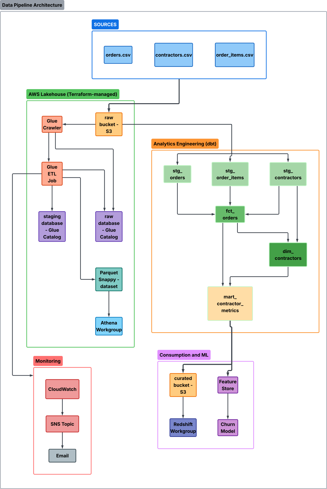

# Remarcable Data Engineering Assignment

A production-representative data pipeline covering medallion data modeling, AWS Lakehouse infrastructure, data quality, and SaaS analytics — built for the Remarcable data engineering take-home.

---

## Scope & Approach

The assignment specified ~4–5 hours across five parts. The repository implements
**100% of the required deliverables** plus a focused set of production-minded
additions that I would ship in a real environment. The split is documented
explicitly so the required work can be evaluated separately from the
extensions:

- **Required deliverables** — see Parts 1–5 sections below. Each section
  starts with the spec checklist.
- **Production extensions** — listed at the end of each Part (e.g. incremental
  materialization for `fct_orders`, S3 lifecycle rules, runaway-job alarm,
  CI workflows). Rationale for every addition is in
  [`ASSUMPTIONS.md`](ASSUMPTIONS.md).
- **Out of scope** — VPC provisioning, real-time CDC, dbt orchestration
  layer. See `ASSUMPTIONS.md` § 6.

All non-obvious decisions (MRR proxy, reference date, retention cohort
definition, SCD type, alerting design) are documented in
[`ASSUMPTIONS.md`](ASSUMPTIONS.md). Reviewers should read that file alongside
this one.

---

## Pipeline Architecture



---

## Project Structure

```
remarcable_project/
├── README.md                    # overview, scope, how to run
├── ASSUMPTIONS.md               # every non-obvious decision, by part
├── dbt_project.yml              # dbt configuration
├── models/
│   ├── sources.yml              # raw source declarations + freshness thresholds
│   ├── schema.yml               # model + column documentation and dbt tests
│   ├── staging/
│   │   ├── stg_orders.sql
│   │   ├── stg_contractors.sql
│   │   └── stg_order_items.sql
│   └── marts/
│       ├── fct_orders.sql
│       ├── dim_contractors.sql
│       └── mart_contractor_metrics.sql
├── tests/
│   ├── test_fct_orders.sql      # singular SQL data quality tests
│   └── dbt_tests_schema.yml     # generic dbt test definitions
├── analytics/
│   └── saas_metrics.sql         # Part 4: MRR, regional AOV, retention, lapsed contractors
├── terraform/
│   ├── backend.tf               # remote state (S3 + DynamoDB)
│   ├── main.tf                  # root module — wires sub-modules
│   ├── variables.tf
│   ├── outputs.tf
│   ├── terraform.tfvars
│   └── modules/
│       ├── s3/                  # raw / staging / curated / athena-results buckets
│       ├── iam/                 # least-privilege roles for Glue, Redshift, Athena, SageMaker
│       ├── glue/                # crawler + ETL job + daily trigger
│       ├── redshift/            # Serverless namespace + workgroup
│       ├── athena/              # workgroup + saved named queries
│       └── cloudwatch/          # log groups, metric filters, SNS alarms
├── glue_scripts/
│   └── raw_to_staging.py        # PySpark ETL: CSV → typed Parquet
└── bonus/
    ├── feature_store.sql         # churn prediction feature table schema + rationale
    └── sagemaker_terraform.tf    # SageMaker S3 bucket + Feature Group resource
```

---

## Part 1 — Data Modeling

### Medallion Architecture

| Layer    | Location          | Format  | Materialization |
|----------|-------------------|---------|-----------------|
| Raw      | `raw.*`           | CSV     | Source (Glue catalog) |
| Staging  | `staging.*`       | Views   | dbt view |
| Marts    | `marts.*`         | Tables  | dbt table / incremental |

### Model Lineage

```
raw.orders          raw.contractors     raw.order_items
      │                   │                   │
stg_orders       stg_contractors      stg_order_items
      │                   │                   │
      └──────────────────►fct_orders◄─────────┘
                          │
             dim_contractors
                          │
             mart_contractor_metrics
```

### Key Design Decisions

- **stg_* models are views** — they always reflect the freshest raw data without materializing cost.
- **fct_orders is incremental** on `order_id` — avoids full table scans as data grows.
- **dim_contractors is SCD Type 1** — for this dataset, overwriting is acceptable. If plan upgrades need history, add a `valid_from / valid_to` pattern (SCD Type 2).
- **amount_variance column** in `fct_orders` deliberately exposes the delta between the order header and computed line-item sum, making data quality issues visible without blocking queries.

### Running dbt

```bash
# Install dbt-redshift adapter
pip install dbt-redshift

# Configure ~/.dbt/profiles.yml with your Redshift Serverless endpoint

# Run all models
dbt run

# Run tests
dbt test

# Generate docs
dbt docs generate && dbt docs serve
```

---

## Part 2 — AWS Lakehouse Infrastructure (Terraform)

### Architecture

```
S3 Raw  ──► Glue Crawler ──► Glue Data Catalog
        ──► Glue ETL Job ──► S3 Staging ──► Athena (ad-hoc)
                        ──► S3 Curated  ──► Redshift Serverless (BI)
```

### Prerequisites

1. AWS CLI configured with sufficient IAM permissions.
2. Bootstrap the remote state backend (one-time):
   ```bash
   aws s3api create-bucket --bucket remarcable-tf-state --region us-east-1
   aws dynamodb create-table --table-name remarcable-tf-locks \
       --attribute-definitions AttributeName=LockID,AttributeType=S \
       --key-schema AttributeName=LockID,KeyType=HASH \
       --billing-mode PAY_PER_REQUEST
   ```
3. Set sensitive values via environment:
   ```bash
   export TF_VAR_redshift_admin_password="<strong-password>"
   ```
4. Update `terraform.tfvars` with your VPC subnet and security group IDs.

### Running Terraform

```bash
cd terraform/

# Format and validate
terraform fmt -recursive
terraform validate

# Preview changes
terraform plan -out=tfplan

# Apply (after review)
terraform apply tfplan
```

### Module Overview

| Module       | Resources |
|--------------|-----------|
| `s3`         | 5 buckets (raw, staging, curated, athena-results, glue-scripts) with versioning, SSE-S3, public-access block, lifecycle rules |
| `iam`        | 4 roles: Glue, Redshift, Athena, SageMaker — all least-privilege |
| `glue`       | Glue Data Catalog (2 databases), crawler, ETL job, scheduled trigger |
| `redshift`   | Serverless namespace + workgroup, `require_ssl=true`, activity logging |
| `athena`     | Workgroup with encrypted results, 10 GB scan cap, 2 saved named queries |
| `cloudwatch` | 2 log groups, SNS topic + email subscription, Glue failure alarm, runaway-duration alarm |

---

## Part 3 — Data Quality

Tests are in `tests/test_fct_orders.sql` (singular SQL tests) and `tests/dbt_tests_schema.yml` (generic dbt tests). Each test returns 0 rows on pass.

### Test Coverage

| # | Check | Type |
|---|-------|------|
| 1 | `order_id` uniqueness | Generic (unique) |
| 2 | No null `order_id` | Generic (not_null) |
| 3 | No null `contractor_id` | Generic (not_null) |
| 4 | Every `contractor_id` exists in `dim_contractors` | Generic (relationships) |
| 5 | No null `created_at` | Generic (not_null) |
| 6 | Status in allowed set | Generic (accepted_values) |
| 7 | `total_amount >= 0` | Custom expression |
| 8 | Header amount ≈ sum of line items (±$0.01) | Custom expression |
| 9 | Completed orders have ≥1 line item | Custom singular |
| 10 | No future-dated orders | Custom singular |
| 11 | No negative counts | Custom singular |
| 12 | Volume spike anomaly detection (3× trailing avg) | Custom singular / warning |

---

## Part 4 — SaaS Metrics

All queries are in `analytics/saas_metrics.sql`.

| Query | Metric | Key Assumption |
|-------|--------|----------------|
| Q1 | MRR trend (6 months) | MRR = sum of completed order amounts per month (procurement proxy for subscription MRR) |
| Q2 | AOV by region | Completed orders only; cancelled excluded from spend |
| Q3 | 30/60/90-day retention by plan | Cohort = month of first completed order; retained = placed ≥1 order within the window |
| Q4 | Lapsed-but-previously-active contractors | Reference date = 2024-06-30 (end of dataset); "active last month" = ≥1 completed order in May 2024 |

---

## Part 5 (Bonus) — AI/ML Readiness

### Feature Store Design (`bonus/feature_store.sql`)

The churn prediction target is: **did the contractor place zero completed orders in the 90 days following the snapshot date?**

Feature groups included:

| Group | Features | Why |
|-------|----------|-----|
| **RFM** | days_since_last_order, orders/spend L30/60/90d, lifetime | Core churn signal; recency and frequency are strongest predictors |
| **Trend** | MoM order count delta, MoM spend delta | Detects acceleration or deceleration before churn occurs |
| **Profile** | plan_type, plan_tier, region, tenure | Segment-level baseline differences in churn rates |
| **Regularity** | avg/stddev days between orders | High stddev → irregular buyer → higher churn risk |
| **Derived ratios** | l30d share of lifetime orders, l90d share of lifetime spend | Normalized features for ML models sensitive to scale |

### SageMaker Integration

- **Offline store**: S3-backed via SageMaker Feature Store, queryable through Athena. Used for training dataset generation.
- **Online store**: Enabled for real-time inference (low-latency PutRecord API after each order event).
- **Point-in-time joins**: `event_time` column prevents training data leakage.
- **Freshness**: Daily batch (Glue job) appends today's snapshot row. Online store updated in near-real-time via event-driven Lambda trigger on order status change.

Terraform resources: `bonus/sagemaker_terraform.tf` provisions the S3 artifact bucket, lifecycle rules, and `aws_sagemaker_feature_group` with all 24 feature definitions.

---

## Assumptions & Trade-offs

Every non-obvious design decision is documented in **[`ASSUMPTIONS.md`](ASSUMPTIONS.md)**, organized by part. Highlights:

- **MRR** is a procurement-spend proxy — the dataset has no subscription
  table. The query shape would not change in a real SaaS environment, only
  the revenue source.
- **Reference date** is anchored to `2024-06-30` (end of dataset) so the
  "last 30 days" queries return non-empty results when run against the
  provided sample data.
- **Cancelled orders** are excluded from revenue and retention metrics,
  preserved in the fact table for cancellation-rate analysis.
- **`fct_orders` is incremental** on `order_id` — full refresh on every dbt
  run does not scale.
- **Terraform not applied** to a live account per the submission
  instructions; CI runs `terraform validate` and `terraform plan` against
  placeholder networking values.

---

## Future Enhancements (Not Implemented)

Production-grade improvements that would be the next iteration but were kept
out of this submission to stay within the time envelope:

- **Slack alerting via AWS Chatbot** — route the SNS alerts topic to a
  `#data-alerts` channel using `aws_chatbot_slack_channel_configuration`.
  Requires a one-time manual OAuth flow in the AWS Console for Slack
  workspace authorization, which is why it is documented here rather than
  provisioned. The SNS topic is already the integration point — adding
  Slack is a single subscription resource.
- **Secrets Manager for Redshift credentials** — replace the
  `TF_VAR_redshift_admin_password` flow with `aws_secretsmanager_secret`
  + rotation.
- **Airflow / Step Functions orchestration** — current setup uses Glue
  scheduled triggers. A workflow engine becomes valuable once there are
  cross-system dependencies (e.g. wait for an external SFTP drop before
  triggering the crawler).
- **PII / column-level access control** — Lake Formation tag-based access
  control on the staging Glue databases.

